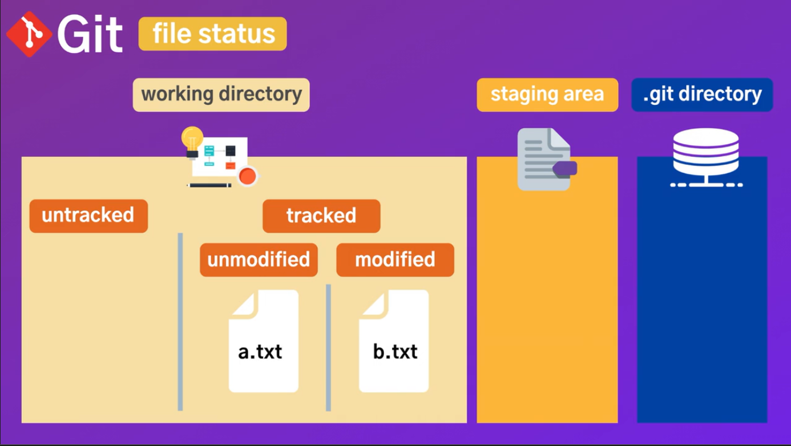

# Dream Version

## SetUp

### Git 초기화하고 Github에 push하기

먼저 Github에 push하기 위해서는 Git WorkFlow 흐름에 대해서 정확히 알고 있어야 한다.<br>

Git WorkFlow는 총 3가지 작업환경으로 나누어져 있습니다.<br>

1. 우리가 프로젝트의 파일을 수정하고 작업하고 있는 `working directory`가 있고<br>
2. 어느정도 작업하다가 버전 히스토리에 저장할 준비가 되어있는 파일들을 옮겨 놓는 `staging area`와
3. 버전의 히스토리를 가지고 있는 `git directory` or `git repository`로 나누어져 있습니다.<br>

즉, 우리는 VSC에서 아무것도 변경되지 않고 가지고 있는 `working directory`와 파일이 변경되면 변경된 내용을 기억하는 `staging area`, 그리고 변경된 내용을 업데이트 하는 `git directory` 총 3가지 환경으로 이루어져 있는 것 입니다.<br>

이러한 단계를 거쳐 우리는 Git의 변경내용을 Github에 히스토리(버전)별로 저장할 수 있습니다.<br>

1. git init(깃 저장소 생성)
2. git add .(working directory에서 변경된 내용을 staging area로 옮기는 과정) / git add .(현재 디렉토리에서 변경된 내용을 staging area로 옮김) or git add -p(working directory에서 변경된 파일들을 전부 보여주고 해당 파일을 하나하나 staging area로 옮길 것인지, 안 옮길 것인지 선택할 수 있다.) + `git status`는 working directory와 staging area의 상태를 확인하기 위해서 git add와 같이 자주 사용됩니다.<br>
3. git commit -m -> staging area에 있는 변경된 내용들 중 git repository에 저장할 내용만 commit하여 히스토리를 갱신할 수 있습니다.<br>
4. git remote add origin <url>(원격 저장소, 즉 깃허브 어디에 저장할 것인지를 정함)<br>
5. git push origin master(원격 저장소에 커밋을 푸쉬함 or 히스토리를 업데이트함!)<br>

---

## Basic

### Git Workflow


Working Directory에는 2가지로 분류될 수 있습니다.<br>

1. 새로 만들어진 파일이어서 깃이 아직 track하지 않은 상태인 `Untracked` 상태
2. git add를 통해 깃이 이미 알고 있어 track중인 `tracked` 상태가 있습니다.
3. tracked는 또 2가지로 분류되는데 1번째는 이전버전과 현재버전에서 달라진 점이 없어 변경내역이 없는 `Unmodified` 상태
4. 수정이 되어 staging area로 이동할 수 있는 `modified` 상태가 있습니다.

이러한 흐름을 가지고 아래의 내용을 봅시다.


1. echo hellow world! > a.txt(b,c도 마찬가지)를 통해 txt파일 3개를 만듭니다.<br>
   이 파일들은 git이 아직 이러한 파일들이 있는지 인식하지 못해 untracked 상태입니다.
2. git add \*.txt 명령어를 통해 staging area로 옮깁니다. 이때부터 깃은 txt파일이 3개가 있다는 것을 인지합니다.<br>
   또한 위 사진에서 보듯이 커밋될 준비가 되어있는 파일이 3개 있다고 git status 명령어를 사용해 확인할 수 있습니다.<br>
3. 여기서 echo tsuel >> a.txt 명령어를 사용해 a텍스트파일에 내용을 추가하니 tracked에서 a.txt가 modified 상태가 된 것을 알 수 있습니다.<br>
   git status를 통해 확인해보면 아직 커밋될 준비가 되지않은 modified된 a.txt가 하나 존재하는 것을 알 수 있습니다.<br>

### 커밋할 때 팁

우리가 파일들을 수정하고 변경한 다음에 마음에 들면 Stagin Area로 옮겨두고 커밋을 하기로 마음을 먹게되면 커밋을 통해 버전을 만들 수 있습니다.<br>
그렇다면 Git Repository에 올라가는 커밋은 어떤 규모가 적당할까?<br>
예를 들어 누군가 전체 어플리케이션을 만들어두고 커밋을 하게 된다면 그 커밋은 아무런 의미가 없게 될 것 입니다. 커밋을 보나 working directory를 보나 똑같기 때문이다.<br>
그래서 커밋을 통째로 하는 것보다는 좀 더 기능별로 세분화하고 작은단위로 만들어 나가는 것이 중요합니다.<br>

그림과 같이 큰 코끼리 하나를 버전으로 만들기보다 작은 코끼리로 여러마리를 두는 것이 버전별로 분리되어 있어 차이점을 알기 수월할 것 입니다.<br>

또한 커밋을 1, 2, 3 ... 순으로 하기보단 위와 같이 무엇을 했는지 알 수 있게 하나하나 의미있는 이름을 지정해서 히스토리를 바라봤을 때 어디서 무엇을 작업했는지 알 수 있게 작성하는 것이 좋습니다.<br>
이렇게 의미있는 이름으로 저장을 하게되면 내가 코드 유지보수를 하는 것도 쉬워지며 원하지 않는 커밋의 취소도 쉬워집니다.<br>

### Git 명령어가 있는 것과 없는 것의 차이

깃 명령어가 없으면 작업 디렉토리에서만 적용되지만 깃 명령어와 함께라면 staging area에도 적용이 되는 것 같다.

```
rm c.txt // working directory에서만 삭제된다.
vs
git rm c.txt // working directory에서 삭제되는 것 뿐만 아니라 staging area에도 삭제된 로그가 기록된다.

rm 명령어만 그런 것이 아니고 대체적으로 git에서도 사용할 수 있는 명령어는 거의 git과 같이 쓰면 statging area에 적용되고 아니면 working directory에만 적용이 되는 듯 하다.
```

### Git 수정 내역 취소하기

```
1) git add 이전, stage에 올리지 않은 경우
git checkout 명령어를 사용해 수정 내역을 취소할 수 있다.
git checkout .(repository 내 전부 취소)
git checkout file_name(지정된 파일만 취소)
git checkout folder_name(지정된 폴더만 취소)

2) git add 이후 stage에 올라간 경우
git reset을 통해 취소할 수 있다.

3) git commit을 한 경우
git reset --hard HEAD^ // commit을 취소하고 내용도 삭제함
git reset --soft HEAD^ // commit을 취소하고 내용은 staged 상태로 남겨둠
git reset HEAD^ // commit을 취소하고 내용은 unstaged 상태로 남겨둠

4) git push를 한 경우
git reset HEAD^ // local repository에서 commit을 하나 되돌림(여러개 하고 싶다면 HEAD뒤에 ^을 개수만큼 붙이면 됨)
git push origin master // 원격 저장소에 커밋하나 뺀 채로 저장
```

### Git HEAD & Master


처음 a라는 커밋을 하고 그 다음 b커밋을 만들게 되면 새로 만든 커밋은 이전커밋을 가리키는 포인터를 생성합니다.<br>
마찬가지로 c라는 커밋을 하게되면 바로 이전 b커밋을 가리키고 d커밋도 c커밋을 가리키는 형식이 된다.<br>
이렇게 커밋을 해나가는 줄기를 `Master Branch`라고 하며 `HEAD`는 가장 최근에 커밋한 d를 가리키게 됩니다.<br>
head에서 물결(~)을 붙이고 숫자를 붙이게되면 현재 헤드보다 숫자만큼 이전버전을 가리키며 원하면 언제든지 head를 이동시킬 수 있습니다.<br>

```
git log --oneline #깃 로그를 한줄로 보여주며 짧은 해시코드도 보여줌
git checkout (커밋해쉬코드) #해시코드를 가진 커밋을 head로 원하는 시점으로 돌아갈 수 있다.
git checkout master #마스터를 head로 이동
```

### Git Log Format

브랜치가 여러개 있을 때 Git Log를 좀 더 명확하게 보고 싶다면 format을 지정해서 브랜치별로 history를 보는 것이 가능하다.<br>


```
먼저 위 사진과 같이 format하는 방법은 다음과 같다.

git log --graph --all --pretty=format:'%C(yellow)[%ad]%C(reset) %C(green)[%h]%C(reset) | %C(white)%s %C(bold red){{%an}}%C(reset) %C(bold blue)%d%C(reset)' --date=short
굉장히 심플해서 한눈으로도 알아보기 쉽다.
문제점은 format해서 보고 싶을 때마다 위의 긴 명령어를 입력해야한다는 것이다.
따라서 이런 귀찮은 짓을 생략하기 위해 alias 명령어를 통해 단축키를 지정해줄 것이다.

git config --global alias.logformat "log --graph --all --pretty=format:'%C(yellow)[%ad]%C(reset) %C(green)[%h]%C(reset) | %C(white)%s %C(bold red){{%an}}%C(reset) %C(bold blue)%d%C(reset)' --date=short"

이제 나는 단 하나의 명령어만 있으면 된다.
git logformat
```

### Git Tag


Git Hitstory에 커밋들이 매우 많아지기 시작한다면 자신이 원할 때 특정 커밋으로 돌아가고 싶을 때 어려움이 있을 수 있습니다.<br>
내가 특정한 커밋을 북마크해두고 싶을 때 사용하는 것이 바로 `git tag`입니다.<br>
북마크를 함으로써 빠르게 특정 시점으로 전환할 수 있습니다.<br>
대부분 북마크를 버전으로 지정하며 `semantic versioning`이라는 시스템을 따라갑니다.<br>

semantic versioning은 major minor fix로 나뉘는데

1. major(전체적인 업데이트가 발생했을 때 갱신)
2. minor(일부 기능들이 업데이트 되었을 때 갱신)
3. fix(오류 개선을 했을 때 갱신)
   과 같은 3가지로 구분합니다.<br>

---

## Branch

### 브랜치를 왜 써야할까?


Git으로 별도로 지정하지 않는 이상 master branch가 기본적으로 사용이 됩니다.<br>
따라서 브랜치를 만들지 않는 경우 master branch에서만 커밋이 일어나게 되죠.<br>
보통 master branch에서는 코드가 검증되고 기능에 문제가 없는 코드들로만 구성이 되어있는데<br>
만약 여기서 새로운 기능인 feature A를 개발한다고 하면 마스터 브랜치에서 개발을 하기 보다는 아래처럼

새로운 feature A 브랜치를 만들어서 새로운 기능을 개발합니다.<br>

또한 브랜치가 있기 때문에 기능별로 새로운 브랜치를 만들게 되면 병렬적으로 새로운 기능을 개발하는데 매우 적합합니다.<br>
만약 이런 상황에서 feature A의 기능이 개발 완료되고 이것을 가져오고 싶다고 하면<br>

이렇게 마스터 브랜치에 `merge`할 수 있습니다.<br>
merge 후 feature A 브랜치는 더 이상 필요 없으니 삭제하기도 가능합니다.<br>

또한 feature A를 그대로 병합해오기보단 e와 f에서 필요한 것만 가져와 i 커밋을 만들고 이것을 마스터 브랜치로 병합하는 방법을 사용하는 방법도 있습니다.<br>

### Fast-Forward-Merges와 Three-Way-Merges의 차이


1. Fast Forward Merges<br>
   마스터 브랜치가 있고 feature A 라는 브랜치에 e와 f가 추가된 형식이다.<br>
   여기서 중요한 점은 브랜치가 나뉘고 나서 master 브랜치에는 아무것도 추가가 되지 않았다는 점입니다.<br>
   브랜치가 나뉜 후 마스터 브랜치에서 커밋을 한 기록이 없기 때문에 `Fast Forward Merges`를 할 수 있게 됩니다.<br>
   그저 merge를 하게 되면 master 브랜치에서 d를 가리키는 HEAD가 feature A의 f로 이동하는 것 뿐이기 때문에 merge commit도 발생하지 않고 모르는 사람이 본다면 merge한 기록이 없기 때문에 마치 한 사람이 작업한 것처럼 보일 것 입니다.<br>
   개인적으로는 이 방법을 선호한다.<br>
   줄여서 ff라고도 하는데 ff를 하는 방법은 간단하다.<br>

```
git merge featureA(fast forward가 가능하다면 아무 옵션 없이 해도 ff로 merge될 것이다.)
```

 2. Three Way Merges<br>
Fast Forward 방식을 싫어거나 어떻게든 merge된 commit을 기록으로 남기고 싶다면 사용하는 방식이다.<br>
아래의 명령어로 Three Way Merge를 할 수 있다.<br>

```
git merge --no-ff featureA(No Fast Forward옵션을 추가함으로써 Three Way Merge로 전향합니다.)
```

1번과 2번 둘 다 merge를 한다는 점에서는 다를점이 없지만 merge commit을 남길 것인가 아닌가에 대한 차이점이 있다.<br>
또한 Three Way Merge를 어쩔 수 없이 써야하는 경우가 있다.<br>

브랜치가 나뉜 후 마스터 브랜치에서 커밋을 하여 마스터의 변경된 점까지 merge해야하는 경우이다.<br>
이런 경우 ff를 하게 되면 위 사진에서 브랜치가 나뉜 후 마스터 브랜치에서 변경된 g 커밋은 적용되지 않게 된다.<br>
따라서 마스터 브랜치의 변경된 점까지 merge를 할 때 사용하는 방식으로 Three Way Merges 사용합니다.<br>
방법은 다음과 같다.<br>

```
git merge featureA(위에서 한 방법과 같은데 ff가 가능하면 ff로 알아서 적용되지만 ff가 안되는 경우 tw로 전향하여 적용되기 때문에 명령어가 같다.)
```

### Conflict 해결하기

Git Conflict는 서로 다른 브랜치에서 같은 파일의 같은 내용을 수정할 때 충돌이 일어나며 Git이 도대체 어떤 브랜치의 수정내역을 가져가야 하는지에 대한 상황이 발생하는 것을 말합니다.<br>
Git Conflict를 해결하는 방법으로는 여러가지가 있는데 수동으로 하는 방법과 툴을 사용해 해결하는 방법이 있습니다.<br>

먼저 마스터 브랜치와 feature브랜치 2개가 있다고 가정합니다.<br>
둘 다 main.txt를 가지고 있고 서로 다른 내용을 가지고 있다면 마스터 브랜치에서 feature브랜치를 merge할 때 Conflict가 발생할 것 입니다.<br>
Conflict를 해결하기 위해서<br>

1. 수동으로 수정하기<br>
   main.txt를 오픈하면 원래 있던 파일의 내용에서 알 수 없는 문자열이 추가된 것을 볼 수 있습니다.<br>
   ```
   <<<<<< HEAD
   Oh.. Here!! From master branch!
   =======
   Oh.. Here!! From feature branch!
   >>>>>> feature
   ```
   HEAD부터는 마스터 브랜치에서 충돌한 코드이며 feature은 feature 브랜치에서 충돌한 코드의 내용을 보여줍니다.<br>
   1. 마스터 브랜치의 코드 가져가기<br>
      HEAD 코드 이외의 것들을 삭제하고 저장합니다.<br>
   2. feature 브랜치의 코드 가져가기<br>
      feature 코드 이외의 것들을 삭제하고 저장합니다.<br>
   3. 마스터와 feature 브랜치 코드 둘 다 살리기<br>
      HEAD코드와 feature코드를 남기고 저장합니다.<br>
2. 툴을 사용해 저장하기(VSCode)
   툴을 사용하면 수동으로 하나씩 수정하지 않아도 버튼 하나로도 어떤 브랜치의 코드를 가져갈 수 있는지 선택하는 것이 가능합니다.<br>
   먼저 VSCode를 사용해 충돌을 해결하려면 아래의 명령어를 사용해 설정을 해줍니다.<br>

```
git config --global -e # 깃 설정을 전역적으로 설정하는데 에디터를 사용함

[merge]
	tool = vscode
[mergetool "vscode"]
	cmd = code --wait $MERGED
[mergetool]
	keepBackup = false

위와 같이 에디터에서 mergetool에 관련된 설정을 합니다.
mergetool 명령어를 사용하면 merge 명령어가 자동으로 실행되며 VSCode가 열릴 때까지 기다리는 역할을 합니다.
keepBackup은 VSC로 merge를 하게되면 원래 충돌되었을 때의 원본 파일인 .orig 파일을 생성하지 않는 것을 의미합니다.
```

위와 같은 설정을 마치고

```
git mergetool
```

명령어를 실행하면 아래와 같이 VSCode가 열리게 됩니다.<br>

위를 자세히 보면 Conflict된 내역에서 총 4가지 선택사항이 있습니다.<br>

1. Accept Current Change -> 현재 마스터 브랜치의 커밋을 적용합니다.
2. Accept Incoming Change -> merge된 브랜치(feature)의 커밋을 적용합니다.
3. Accept Both Change -> 마스터와 feature 브랜치 2개의 커밋을 적용합니다.
4. Compare Change -> 마스터와 feature 브랜치의 차이점을 더 알기 쉽게 보여줍니다.

어떤 브랜치의 커밋을 가져갈 것인지 결정 후 저장한 다음 VSCode를 나오게 되면 git status를 통해 확인 시 충돌된 코드가 수정되어 적용이 된 것을 확인할 수 있습니다.<br>
이제 `git merge --continue`명령어를 사용하면 `Three way Merges`를 통해 merge를 계속해서 할 수 있습니다.<br>
현업에서는 VSCode 외에도 P4Merge라는 툴을 사용한다고 하는데 현재로서는 VSCode만 있어도 될 듯 싶다.<br>

---

## Stash

### Stashing이 무엇이고 왜 중요할까?


우리가 working directory에서 무언가를 작업하고 있다고 가정합시다.<br>
그런데 위와 같이 직장 사수가 내 브랜치를 지금 당장 테스트 해줬으면 좋겠다고 합니다.<br>
이럴 경우에 우리가 working directory에서 작업하고 있는 것들을 어떻게 해야 좋을까요?<br>
커밋을 하자니 완벽한 기능을 만들지 않았는데 커밋하는 것은 별로이며 그렇다고 working directory에서 작업한 것을 싹 다 지우고 브랜치를 테스트 하자니 지금까지 작업하던 것들을 테스트가 끝나고 다시 작업하려니 시간적으로 낭비가 큽니다.<br>
따라서 지금하고 있는 작업들을 잠시 보관해뒀다 브랜치 테스트가 끝나고 다시 가져와서 하고 싶은 겁니다.<br>
이러한 경우에 우리는 `Stash`를 사용해 working directory에서 하고 있던 작업들을 잠시 저장해둘 수 있습니다.<br>

Stash 기능 덕분에 위 캡처와 같이 working directory에서 작업하던 내용들을 모두 stash하여 stash stack에 잠시 옮겨두고 branch를 테스트가 끝나면 다시 stash stack에서 stash를 가져와서 작업을 이어서 진행할 수 있습니다.<br>

```
Stash에 저장하는 명령어는 push
Stash에 있는 내용을 보는 명령어는 show
Stash에 있는 내용을 가져오면서 남겨두는 명령어는 apply
Stash에 있는 내용을 가져오면서 삭제하는 명령어는 pop
Stash를 삭제하는 명령어는 drop or clear 등이 있습니다.
```

---

## Undo

### 실수를 만회하는 방법들

1. 내가 커밋을 너무 성급하게 해서 모든 수정사항을 함께 commit하지 못한 경우
2. 커밋의 메시지가 마음에 들지 않는 경우
3. 커밋을 한번에 너무 많이해서 여러가지로 잘라서 커밋을 하고 싶은 경우
4. 반대로 커밋을 너무 조금씩 해서 하나로 묶고 싶은 경우
5. 내가 실수로 버그를 도입한 경우 그 커밋을 삭제하거나 되돌리고 싶은 경우
   이러한 모든 경우에 대해 대처하는 방법을 알아보자.<br>

```
1) 커밋되기 이전에 원래 상태로 초기화하는 방법
-working directory
1> git restore (파일 이름 or .) -> Modifying된 파일들의 경우에 사용하는 초기화 명령어
2> git clean -fd -> Untracked된 파일들의 경우에 사용하는 초기화 명령어
-staging area
git restore --staged (파일 이름 or .) -> Staging Area에 있는 파일들의 경우에 사용하는 초기화 명령어

2) 커밋이 된 후, Git repository에서 원래 상태로 초기화하는 방법
git reset HEAD(~숫자) -> HEAD에서 숫자만큼 떨어진 커밋으로 초기화시킨다.
// 옵션에는 --soft --mixed(default) --hard가 있으며 각각 work flow에서 한단계씩 더 삭제한다.

3) 커밋을 수정하고 싶은 경우
수정사항을 적용하고 git commit --amend (-m) -> 마지막 커밋의 메시지나 수정사항을 적용할 수 있다.
```

### Git Reflog & Revert & Rebase

1. git reset을 사용해 이미 없어진 커밋의 예전 시점으로 돌아가고 싶을 때 사용하는 `git reflog`
2. 원하는 커밋을 취소할 수 있는 `git revert`
3. 어떤 커밋이든 수정할 수 있는 `git rebase`
   에 대해 알아봅시다.<br>

- git reflog<br>
  git reflog명령어를 사용하면 이전에 HEAD가 가리키고 있었던 내용들을 다 기억하고 있고 그것을 보여줌으로써 우리가 원하는 시점으로 되돌아갈 수 있습니다.
  
  위와 같이 reflog를 통해 HEAD가 가리키고 있었던 내용들을 다 기억하면서 원하는 커밋의 해시코드를 복사해와서<br>
  git reset --hard hash를 사용하면 원하는 커밋으로 돌아갈 수 있습니다.<br>
  다만 주의해야할 점은 로컬에 작업하고 있던 중에 reset --hard를 사용하게 되면 작업내용을 다 잃을수도 있으므로 반드시 커밋 이전의 상태나 커밋 후 해야합니다.<br>

- git revert<br>
  git revert명령어는 이전 커밋 중 취소하고 싶은 커밋이 있다면 사용할 수 있습니다.<br>
  git revert HEAD~(숫자) 또는 HASH를 사용해서 취소하고 싶은 커밋을 취소할 수 있다.<br>
  revert는 주로 함부로 건드려선 안되는 원격 저장소의 커밋을 취소하고 싶은 경우에 사용하면 됩니다.<br>
  revert는 history를 바꾸는 것이 아니라 커밋을 추가해서 이미 추가된 내용을 변경하는 것이므로 가능한 일이다.<br>

- git rebase<br>
  git rebase명령어를 -i(interactive)옵션을 가지고 사용하면 어떤 커밋이든지 수정할 수 있는 꿀템이다.<br>
  git rebase는 수정하고 싶은 커밋의 이전 커밋부터 시작해야합니다.<br>
  
  예를 들어 WIP커밋을 수정하고 싶다면 그 이전 커밋인 Add payment... 커밋으로부터 rebase를 진행해야 하는 것입니다.<br>
  중요한 것은 rebase는 한개만 수정하더라고 그 뒤에 있는 모든 커밋까지 업데이트되어 히스토리가 변경되므로 원격 저장소에 이미 푸쉬된 경우라면 피하고 주의해서 사용해야할 것 입니다.<br>
  (rebase가 끝나고 나면 해쉬코드가 변경되어있기 때문)

### Git Rebase로 필요없는 커밋을 삭제하기

서버에 이미 푸쉬가 된 상태라면 reflog rebase를 사용하기보단 `revert`를 사용하는 것이 맞다.<br>
이전에 있던 커밋은 놔두고 취소하고 싶은 커밋의 반대커밋을 새로 만들어주기 때문에 히스토리가 변경되지 않기 때문이다.<br>
만약 서버에 업로드되지 않고 로컬 저장소에서 아직 취소하고 싶은 커밋이 존재한다면 `rebase`를 사용해 취소하는 것이 가능하다.<br>

1. 먼저 취소하고 싶은 이전 커밋의 해쉬코드를 `git rebase -i hash`명령어를 통해 수정해보자.
2. rebase에서 커밋을 삭제하는 명령어는 drop(d)이므로 pick -> drop(d)로 바꾼 후 저장을 하면 커밋이 삭제된다.
   
3. drop이 낳는 결과는 2가지 중 하나이다. 첫째는 아무일 없이 커밋이 삭제가 되는 것. 둘째는 컨플릭트가 발생하여 커밋을 삭제하지 못하는 것이다.
   
4. 커밋을 삭제하고 싶어도 그 이후의 커밋에서 삭제할 커밋의 내용을 수정하고 있다면 이미 없는 내용을 수정하고 있기 때문에 컨플릭트가 발생하는 것이다.
5. 따라서 깃은 컨플릭트를 어떻게든 해줘!라고 경고를 내리게 되는데 이 경우에 `git add .`명령어를 사용해 충돌이 난 커밋에서 그냥 원래 쓰던 커밋을 적용할 수 있게 해준다.
6. 컨플릭트를 해결한 후 git rebase --continue를 통해 커밋을 완전하게 삭제할 수 있습니다.

### Git Rebase로 커밋 분할하기

커밋은 한가지 기능만 수행해야 합니다.<br>
그런데 만약 한 커밋에 너무 많은 기능이 들어있는 것 같다면 분리하는 것이 좋은 방법일 것 입니다.<br>

1. 먼저 취소하고 싶은 이전 커밋의 해쉬코드를 `git rebase -i hash`명령어를 통해 수정해보자.
2. rebase에서 커밋을 수정하는 명령어는 edit(e)이므로 pick -> edit(e)로 바꾼 후 저장을 하면 커밋을 수정할 수 있다.
   
3. 우선 수정할 커밋을 다시 working directory로 가져와야 합니다. 이것은 `git reset HEAD~1`명령어를 사용해 할 수 있습니다.
4. 이제 working directory에서 기능별로 작업 내용을 나누어 따로따로 staging area로 옮기고 커밋을 하도록 합니다.<br>
   이제 git log를 보면 하나의 커밋이 2개로 나누어져있는 것을 볼 수 있습니다.<br>
   
5. 마지막으로 `git rebase --continue`명령어를 사용해 rebase를 finish할 수 있도록 합니다.<br>
   `Add payment service & library`커밋이 2가지로 분할이 된 것을 확인할 수 있습니다.<br>
   

### Git Rebase로 커밋 합치기

1. 먼저 취소하고 싶은 이전 커밋의 해쉬코드를 `git rebase -i hash`명령어를 통해 수정해보자.
2. rebase에서 커밋을 합치는 명령어는 squash(s)이므로 수정할 커밋 중 첫 번째 커밋을 제외한 나머지 커밋을 pick -> squash(s)로 바꾼 후 저장을 하면 커밋을 합칠 수 있습니다.<br>
   
3. 1번에서 2번처럼 커밋 메시지를 변경합니다.<br>
   1번<br>
   <br>
   2번<br>
   <br>
4. 마지막으로 `git rebase --continue`명령어를 사용해 rebase를 finish할 수 있도록 합니다.<br>
   커밋이 합쳐진 것을 확인할 수 있습니다.<br>
   <br>

꼭 기억해야 할 것은 rebase는 하나의 커밋만 수정하더라도 그 뒤에있는 모든 커밋들의 해쉬코드까지 바뀌기 때문에 원격 저장소에 푸쉬하게 되면 다른 개발자들이 푸쉬했던 커밋과 달라져서 혼란이 발생할 수 있다.<br>
원격 저장소에 push되어있다면 절대 rebase를 사용하지 말 것!

---

## Github

### 깃허브의 필요성

<br>
우리가 local 환경에서 git repository를 생성하고 history를 만든다면 위와 같은 문제가 생길수도 있습니다.<br>
그래서 만약에 내 PC에 문제가 생기거나 다른 환경에서 작업하고 싶을 때 repository에 접근이 불가능합니다. 또한 history를 영영 잃게 될 수도 있습니다.<br>

<br>
따라서 이것을 방지하고 다른 사람들과의 협업을 위해서 `remote`라는 서버에 나의 git repository를 업로드하여 다른 PC에서도 접근이 가능하며 다른 개발자들과 함께 개발을 해나갈 수 있습니다.<br>

### 깃허브 사용방법

1. clone
   <br>
   원격 서버에 업로드 되어있는 repository를 나의 로컬 환경에서 작업하고 싶다면 `clone`을 사용해 서버의 repository를 가져올 수 있습니다.<br>
2. push
   <br>
   서버에서 가져온 repository를 clone하고 내가 로컬에서 작업한 내용을 서버에 업데이트하고 싶다면 `push`를 사용해 원격 서버에 업로드할 수 있습니다.<br>
   참고로 `git push -f`명령어는 서버에 있는 내용을 무시하고 로컬의 변경사항을 적용하니 주의하여 써야합니다.<br>
3. pull
   <br>
   여러 개발자들이 함께 개발하다보면 내가 push한 커밋 외에 다른 개발자들이 push한 커밋들이 원격 서버에 존재할 수 있습니다.<br>
   이러한 경우에 원격 저장소에 업데이트되어있는 내역을 내 repository로 가져오고 싶다면 `pull`을 사용해 업데이트 내역을 가져올 수 있습니다.<br>
   여기서 만약 다른 개발자들과 내가 작업한 내역 중에 충돌이 발생할 수 있는데 우리가 전에 배운 `merge confilct`를 통해 해결해나갈 수 있습니다.<br>

### 오픈소트 프로젝트 참여하기

<br>
먼저 여러 멋진 개발자들이 활발하게 참여하는 오픈소스 프로젝트가 하나 있습니다.<br>
여기에서 나도 오픈소스 프로젝트에 참여하고 싶다면 오픈소스 레포지토리에 커밋을 바로 푸쉬할 수 있는 것은 아니고 오픈소스 프로젝트를 먼저 `fork`해와야 합니다.<br>
위와 같이 레포지토리를 fork해서 내 레포지토리에서 커밋을 푸쉬한 후 `PR(Pull Request)`를 오픈소프 프로젝트에 제출하게 됩니다.<br>
그러면 오픈소스 프로젝트 관리자가 PR을 보고서 PR을 승인할 것인지 거절할 것인지를 결정하고 만약 승인이 된다면 이제 오픈소스 프로젝트에 커밋이 푸쉬되게 되는 것입니다.<br>
<br>
이제 오픈소스 프로젝트에 나의 새로운 커밋이 반영되고 반영된 오픈소스 프로젝트를 가져오고 싶다면 `rebase`를 사용해 내 레포지토리로 업데이트를 가져올 수 있습니다.<br>
그런다음에 `merge PR`을 또 할 수 있게 되는 것입니다.<br>

### fetch vs pull

<br>
서버에서 새로운 커밋이 발생하여 나의 로컬 히스토리와 다르다면 `fetch`를 사용하여 서버의 히스토리를 업데이트할 수 있습니다.<br>
다만 fetch는 서버의 히스토리를 업데이트만하고 나의 로컬 작업환경은 그대로 유지해줍니다.<br>
캡처와 같이 로컬 master와 origin/master는 서로 다른 HEAD를 가리키고 있음을 알 수 있습니다.<br>
<br>
서버에서 새로운 커밋이 발생하여 나의 로컬 히스토리와 달라 히스토리를 업데이트하고 싶다면 `fetch`외에도 `pull`이라는 명령어를 사용할 수 있습니다.<br>
fetch와 pull의 차이점은 fetch는 앞서 말한 것과 같이 서버의 히스토리 내역을 업데이트하지만 로컬 작업내용은 그대로 유지시켜주지만 pull은 서버의 히스토리를 가져옴과 동시에 merge를 발생시켜 나의 로컬 히스토리도 서버의 히스토리와 동일하게 만들어주는 것을 알 수 있습니다.<br>
캡처와 같이 master와 origin/master는 같은 HEAD를 가리키는 것을 볼 수 있습니다.<br>

### pull merge conflict

pull명령어는 서버의 히스토리를 가져와 업데이트해주는 아주 편리한 명령어지만 만약 서버의 히스토리와 로컬 히스토리에서 동일한 파일을 수정했다면 `conflict`이 아주 흔하게 발생할 수 있습니다. 특히 협업을 하게되면 conflict는 피해갈 수 없습니다.<br>

<br>
예를 들어 add.txt파일을 로컬에서 수정을 하고 local change라는 커밋을 가지고 있고<br>
<br>
서버에서 add.txt파일을 수정을 해서 Remote라는 커밋을 가지고 있다고 가정을 합니다.<br>
<br>
여기서 만약에 어떤 개발자가 서버의 히스토리를 업데이트 하고 싶어서 `git pull`명령어를 사용했습니다.<br>
그럼 위 캡처처럼 add.txt파일에서 컨플릭트가 발생했다고 메시지가 나오는 것을 알 수 있습니다.<br>
우리가 컨플릭트를 해결하기 위해서 앞에서 컨플릭트를 해결한 방법을 그대로 사용하면 됩니다.<br>
`git mergetool`명령어를 사용하여 현재 컨플릭트가 어디서 발생했는지 확인하고 수정한 후에 mergetool을 종료하고 나와서 `git add .`명령어로 staging area로 옮겨주고 `git merge --continue`명령어를 사용해 merge를 계속해서 진행합니다.<br>
<br>
위와 같이 컨플릭트가 발생한 로컷커밋과 서버커밋이 merge된 것을 확인할 수 있습니다.<br>
그런데 fast-forward가 아닌 three-way-forward가 발생하여 조금 지저분하게 merge가 되어있는데 이 부분도 원한다면 고칠 수 있습니다.<br>
<br>
바로 `git pull --rebase`명령어를 사용하는 것입니다.<br>
git pull --rebase -> git mergetool -> git rebase --continue를 단계를 거처 merge를 완료하면
<br>
서버에서 받아온 커밋은 그대로 유지되며 로컬커밋도 ff로 merger가 된 것을 확인할 수 있습니다.<br>
